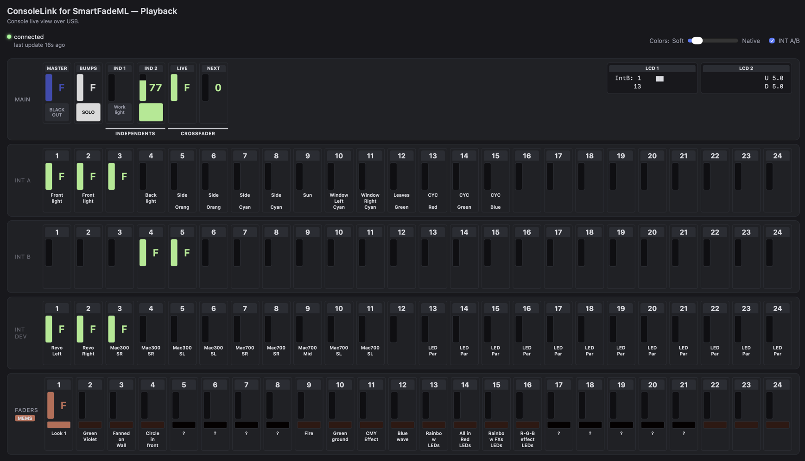
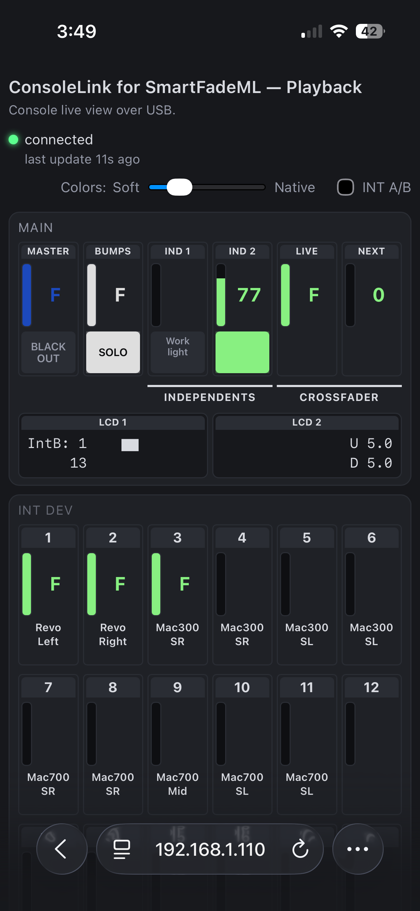

# ConsoleLink

Talk to an ETC SmartFade ML lighting console over USB and see its live state
(faders, master, bumps, independents, solo/blackout, both LCDs) without SmartSoft.

Built from a reverse-engineered wire protocol; see [`protocol.py`](protocol.py)'s
module docstring for the details.

The protocol was reverse-engineered by running the original SmartSoft software
under Windows 10 against a SmartFade ML console, while capturing the USB
traffic with Wireshark. Each capture isolated a single step (initial
connection, moving one fader, pressing one button, etc.) so the resulting
traces could be matched to a specific action.

## Screenshots

The web app (`consolelink.py`) in a desktop browser:



And on a phone, where each row wraps to 6 columns:



## Contents

| File | What it is |
|---|---|
| [`protocol.py`](protocol.py) | Shared library: USB framing, the idle-poll/announce/ack handshake, and decoders for every known message type. Everything else imports this rather than re-deriving the protocol. |
| [`consolelink.py`](consolelink.py) | The program: polls the console in a background thread and serves [`index.html`](index.html) over Server-Sent Events, so a browser tab shows live values. With `--no-web` it only polls (logging changes with `--debug`, or sending Art-Net). |
| [`artnet.py`](artnet.py) | Optional Art-Net output of the two DMX universes, enabled with `--artnet`. |
| [`index.html`](index.html) | Static single-page UI for `consolelink.py`: intensity meters (INT A / INT B / INT DEV), physical faders, most important buttons and indicators, like BlackOut and Master, and a mirror of the console's two LCDs, plus a "DMX Outputs" tab showing both DMX universes (1024 channels) at once. |
| [`app.js`](app.js) | Front-end logic for `index.html`: builds the meter grid, connects to the SSE stream, and renders each incoming state update. |
| [`environment.yml`](environment.yml) | Conda-forge environment spec (recommended -- see Requirements below). |
| [`requirements.txt`](requirements.txt) | Plain pip dependencies, for setups not using conda. |
| [`requirements-dev.txt`](requirements-dev.txt) | pip dependencies plus `pytest`, for running the tests. |
| [`tests/`](tests/) | Decoder and server tests, replaying recorded console traffic from [`tests/fixtures/`](tests/fixtures/) -- no console needed. |

## Requirements

- [`pyusb`](https://pypi.org/project/pyusb/), backed by a native `libusb` library
- The console connected over USB and powered on

**Recommended: conda-forge.** `pyusb` needs a native `libusb` backend, and
conda-forge packages both together so there's no separate system install step:

```
conda env create -f environment.yml
conda activate consolelink
```

**Alternative: pip.** If you'd rather not use conda, install `pyusb` via pip
and provide `libusb` yourself:

```
pip3 install -r requirements.txt
brew install libusb   # macOS; see pyusb's docs for other platforms
```

consolelink.py looks for the console at `idVendor=0x14D5, idProduct=0x0201` and
claims the vendor bulk interface directly — no vendor driver required, but you
may need permissions to access the raw USB device (on macOS this generally
works out of the box for a user-space process).

## Usage

```
python3 consolelink.py [--debug] [--capture PATH] [--no-web] [--artnet [DEST]]
```

Run it from inside this folder. Then open http://localhost:8765. The page updates live as
controls move; it also auto-reconnects if the console is unplugged and replugged.

For terminal use only, without the web server: `python3 consolelink.py --no-web --debug` prints
every control change (and any message type that isn't decoded yet) until Ctrl+C.

The server listens on all network interfaces, so a phone or another computer on
the same network can open it too, at `http://<IP>:8765`. To get the IP of the
machine running `consolelink.py`:

```
ipconfig getifaddr en0   # macOS (en0 is usually Wi-Fi; try en1 for Ethernet)
hostname -I              # Linux
ipconfig                 # Windows (look for "IPv4 Address" under your Wi-Fi or Ethernet adapter)
```

**Command-line options:**

| Flag | Effect |
|---|---|
| `--debug` | Per-control change logging to stderr (including DMX changes), plus a liveness heartbeat, handshake diagnostics, and a line for every message type that has no decoder yet. |
| `--capture PATH` | Append every message (decoded or not) as a timestamped hex line to `PATH`, for comparing against a packet capture when something behaves unexpectedly. |
| `--no-web` | Don't start the web server, just poll the console. Needs at least one of `--debug`, `--capture`, `--artnet`. |
| `--artnet [DEST]` | Send both DMX universes as Art-Net to `DEST` (an IP address, or `broadcast`). Bare `--artnet` sends to `127.0.0.1`. Off by default. |
| `--artnet-universe N` | Art-Net universe for console universe 1; universe 2 goes to N+1. Default 0. |
| `--artnet-rate HZ` | Maximum send rate when levels change. Default 40. |
| `--artnet-keepalive SEC` | Re-send the last frame this often when nothing changes. Default 1. |

Run with `--help` for the full option list.

### Art-Net output

```
python3 consolelink.py --artnet                    # visualiser on this machine
python3 consolelink.py --artnet 192.168.1.50       # an Art-Net node or another computer
python3 consolelink.py --artnet broadcast          # whole local network
```

Console universe 1 and 2 are sent as Art-Net universes 0 and 1 (change with `--artnet-universe`).
Art-Net counts from 0, so some software labels these "1" and "2" — if a visualiser shows nothing,
try the neighbouring universe numbers. On the same machine, set the visualiser's Art-Net input to
listen on UDP port 6454 (some let you pick the network interface: choose loopback or "all").

If several programs on this machine listen on port 6454 (say a visualiser and an Art-Net monitor),
a unicast destination reaches only one of them. Use `--artnet broadcast` to feed all of them.

The console only reports DMX when a patched output changes, but Art-Net receivers expect a steady
stream, so the last frame is re-sent every second (`--artnet-keepalive`) while nothing moves. If the
console is unplugged, the last frame keeps being sent.

Frames go console → USB → this program → UDP with no timing guarantee, so this is fine for
visualisation and casual use, not for anything where a stall or a frozen frame would be a problem.

## How it works

The console speaks a request/reply protocol over two USB bulk endpoints: a
12-byte header (msgType, payloadLen, 4×uint16 state) is polled OUT
repeatedly, and the console replies with its own header, followed by a
payload when it has one. When a control changes, the console first sends an
"announce" (payload type `0x28`) naming which object type(s) are ready; the
host acks by naming that type back, then the real payload follows. Both
tools also proactively request the types they need at connect time
(`ConsoleLink.request_type()`) rather than waiting for an announce, since
the console's own unprompted announce loses a race against the OS's USB
probing on connect.

See `protocol.py`'s module docstring for the full message-type breakdown
(which types are decoded, which are known-but-not-yet decoded, and why).

## Tests

The tests replay real console traffic recorded from a SmartFade ML, so they
run without a console attached:

```
python -m pytest
```

(`pytest` is included in `environment.yml`; with pip, use
`pip install -r requirements-dev.txt`.)

Each file in `tests/fixtures/` is a few messages in the same line format
`--capture` writes, with comments saying what the console was doing, and
`# @tag:` lines naming the messages the tests look up. The expected values in
the tests are what the console itself showed at the time -- not just whatever
the decoder currently returns -- so a decoder change that breaks one is a real
regression.

## License

MIT -- see [`LICENSE`](LICENSE).
