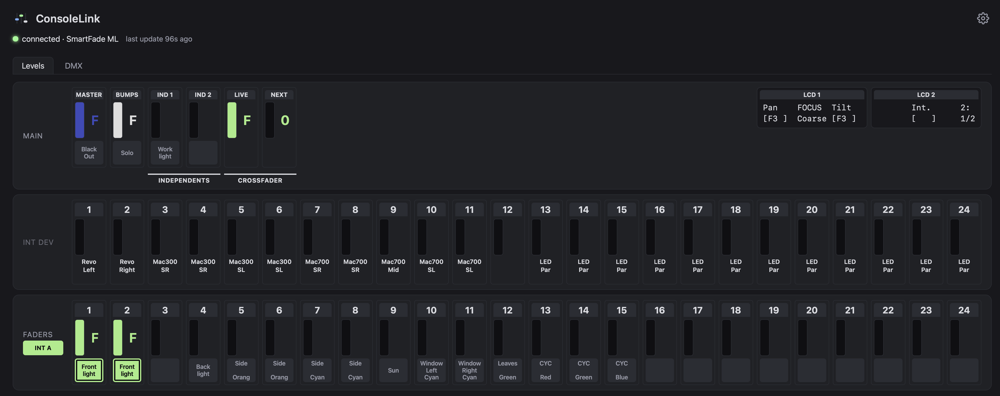
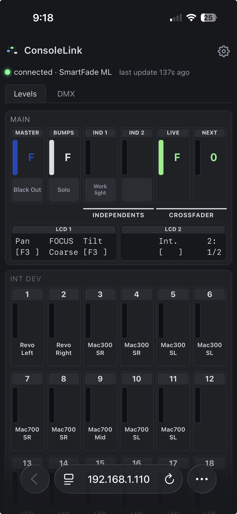
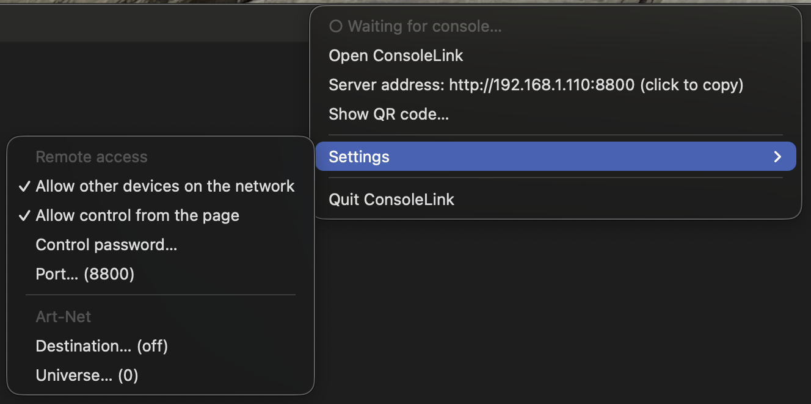

# ConsoleLink

ConsoleLink is an original software tool designed to communicate with existing lighting desks
and add new features:

- Web interface that mirrors and controls the console from any browser
- Art-Net output

It keeps these consoles usable when the manufacturer's software is not updated or supported on current operating systems.

ConsoleLink was tested with SmartFade ML, by Electronic Theatre Controls, Inc. (ETC).
Support for more lighting desks may be added in later releases.

**Disclaimer**: ConsoleLink is an independent project and is not affiliated with, endorsed by, or sponsored by ETC.
SmartFade and SmartSoft are trademarks of ETC and are used here only to identify compatible products.
Use at your own risk; no warranty is provided.

## Contents

- [Screenshots](#screenshots)
- [Requirements](#requirements)
- [Install](#install)
  - [Pip](#pip)
  - [Conda-forge](#conda-forge)
- [Usage](#usage)
  - [macOS menu-bar app](#macos-menu-bar-app)
  - [Art-Net output](#art-net-output)
- [For Developers](#for-developers)
  - [How it works](#how-it-works)
  - [Protocol study process](#protocol-study-process)
  - [Source files](#source-files)
  - [Development install](#development-install)
  - [Tests](#tests)
  - [Releasing](#releasing)
- [License](#license)

## Screenshots

The web app (`consolelink`) in a desktop browser:



And on a phone, where each row wraps to 6 columns:



## Requirements

- Python 3.10 or newer. macOS's built-in `python3` is older (3.9): install a current one, for
  example `brew install python`, and create the virtual environment below with it
- A native `libusb` library, which `pyusb` uses to talk to the console:
  `brew install libusb` on macOS, `sudo apt install libusb-1.0-0` on Debian/Ubuntu
  (Windows: not tried)
- The console connected over USB and powered on

ConsoleLink looks for the console at `idVendor=0x14D5, idProduct=0x0201` and
claims the vendor bulk interface directly — no vendor driver required, but you
may need permissions to access the raw USB device (on macOS this generally
works out of the box for a user-space process).

## Install

### Pip

Run these from the folder that contains `pyproject.toml` (your clone of this repo):

```
python3 -m venv .venv
source .venv/bin/activate
```

Then install, depending on your system:

- **macOS (recommended, includes the menu-bar app):**

  ```
  pip install '.[menubar]'
  ```

- **Linux, Windows, Raspberry Pi, or macOS with the command line only:**

  ```
  pip install .
  ```

Both install `pyusb`, the package with its web files, and the `consolelink` command. The `menubar`
extra also installs `rumps` and `keyring`, which the menu-bar app
([below](#macos-menu-bar-app)) needs (macOS only: elsewhere the extra adds nothing).
Activate the environment again (`source .venv/bin/activate`) in any new terminal before running
`consolelink`.

### Conda-forge

**With conda instead:** conda-forge packages `libusb` together with `pyusb`, so there's no
separate system install.

```
conda create -n consolelink python=3.11 pyusb libusb
conda activate consolelink
pip install '.[menubar]'   # on macOS (recommended); everywhere else: pip install .
```

## Usage

```
consolelink [--debug] [--capture PATH] [--no-web] [--artnet [DEST]]
            [--listen localhost|network] [--port N] [--allow-write [PASSWORD]]
```

(or `python -m consolelink ...`). Then open http://localhost:8765. The page updates live as
controls move; it also auto-reconnects if the console is unplugged and replugged.

For terminal use only, without the web server: `consolelink --no-web --debug` prints
every control change (and any message type that isn't decoded yet) until Ctrl+C.

By default only the machine running `consolelink` can open the page. With `--listen network`
the server listens on all network interfaces, so a phone or another computer on the same
network can open it too, at `http://<IP>:8765`. To get the IP of the machine running
`consolelink`:

```
ipconfig getifaddr en0   # macOS (en0 is usually Wi-Fi; try en1 for Ethernet)
hostname -I              # Linux
ipconfig                 # Windows (look for "IPv4 Address" under your Wi-Fi or Ethernet adapter)
```

**Command-line options** (`consolelink --help` lists them too):

- `--debug`: per-control change logging to stderr (including DMX changes), plus a liveness
  heartbeat, handshake diagnostics, and a line for every message type that has no decoder yet.
- `--capture PATH`: append every message (decoded or not) as a timestamped hex line to `PATH`, for
  comparing against a packet capture when something behaves unexpectedly.
- `--no-web`: don't start the web server, just poll the console. Needs at least one of `--debug`,
  `--capture`, `--artnet`.
- `--listen localhost|network`: who can open the web page. `localhost` (the default) means only
  this machine; `network` also serves it to every device on the same network. Not for `--no-web`.
- `--port N`: port of the web page. Default 8765.
- `--allow-write [PASSWORD]`: let the web page control the console: BlackOut, Solo, Ind 1/2, the bump
  buttons (press and hold the LED under a fader), the MEMS page, and the 24 faders, MASTER, BUMPS,
  LIVE and NEXT (drag a bar), and in MEMS mode the INT ONLY and GO MODE buttons. Off by default.
  With the default `--listen localhost` the password is optional: without one, the controls are
  unlocked straight away, and the server only accepts writes from the page served on localhost (it
  checks the Host and Origin headers, so another website open in your browser can't press buttons).
  With `--listen network` a `PASSWORD` is required, and every write must carry it: type it once in
  the page's settings ("Control password", kept in that browser) and the controls unlock. The
  password travels in the URL over plain HTTP, so it keeps casual users out and nothing more:
  enable writing over the network only on a network you trust. On a touch screen a fader must be
  tapped (it gets an outline) before it drags, so scrolling the page doesn't move faders.
- `--artnet [DEST]`: send both DMX universes as Art-Net to `DEST` (an IP address, or `broadcast`).
  Bare `--artnet` sends to `127.0.0.1`. Off by default.

**Advanced options** (Art-Net tuning):

- `--artnet-universe N`: Art-Net universe for console universe 1; universe 2 goes to N+1.
  Default 0.
- `--artnet-rate HZ`: maximum send rate when levels change. Default 40.
- `--artnet-keepalive SEC`: re-send the last frame this often when nothing changes. Default 1.

### macOS menu-bar app



On macOS the same service can run from the menu bar instead of the command line (no Dock icon, no flags to remember):

```
pip install '.[menubar]'  # skip if you installed with it already (see Install)
consolelink-menubar       # or: python -m consolelink.menubar
```

The menu-bar icon (the favicon's three faders, faded while there is no console) and the first menu line show whether the console is connected. The menu has:

- **Open ConsoleLink**: opens the page in the browser.
- **Server address** (only when other devices are allowed): the address another device opens;
  click to copy it. **Show QR code…** opens a small window with that address as a QR code: scan it
  with a phone or tablet camera to open the page. The code holds the address only, never the
  password.
- **Settings**: allow other devices on the network (`--listen network`), allow control from the
  page (`--allow-write`), the control password, the Art-Net destination and universe, and the
  port. The password is kept in the macOS Keychain; the rest in
  `~/Library/Application Support/ConsoleLink/settings.json`. A change is saved and applied right
  away (the service restarts).
- **Quit ConsoleLink**: releases the console before exiting.

Only one program can use the console at a time, so don't run `consolelink` and the menu-bar app
together. The command line works as before on every system; the menu-bar app is macOS only.

### Art-Net output

```
consolelink --artnet                    # visualiser on this machine
consolelink --artnet 192.168.1.50       # an Art-Net node or another computer
consolelink --artnet broadcast          # whole local network
```

Console universe 1 and 2 are sent as Art-Net universes 0 and 1 (change with `--artnet-universe`).
Art-Net counts from 0, so some software labels these "1" and "2" — if a visualiser shows nothing,
try the neighbouring universe numbers. On the same machine, set the visualiser's Art-Net input to
listen on UDP port 6454 (some let you pick the network interface: choose loopback or "all").

If several programs on this machine listen on port 6454 (say a visualiser and an Art-Net monitor),
a unicast destination reaches only one of them. Use `--artnet broadcast` to feed all of them.

The console only reports DMX when a patched output changes, but Art-Net receivers expect a steady
stream, so the last frame is re-sent every second (`--artnet-keepalive`) while nothing moves. If the
console is unplugged, the last frame keeps being sent.

Frames go console → USB → this program → UDP with no timing guarantee, so this is fine for
visualisation and casual use, not for anything where a stall or a frozen frame would be a problem.

## For Developers

### How it works

The console speaks a request/reply protocol over two USB bulk endpoints: a
12-byte header (msgType, payloadLen, 4×uint16 state) is polled OUT
repeatedly, and the console replies with its own header, followed by a
payload when it has one. When a control changes, the console first sends an
"announce" (payload type `0x28`) naming which object type(s) are ready; the
host acks by naming that type back, then the real payload follows.
ConsoleLink also proactively requests the types it needs at connect time
(`ConsoleLink.request_type()`) rather than waiting for an announce, since
the console's own unprompted announce loses a race against the OS's USB
probing on connect.

See [`protocol.py`](src/consolelink/protocol.py)'s module docstring for the full message-type breakdown
(which types are decoded, which are known-but-not-yet decoded, and why).

### Protocol study process

The general process to establish the protocol details was to capture USB traces using the original software and consoles,
and study the traces to understand the wire protocol.

For the SmartFade ML case in particular, the traces were obtained running the original SmartSoft software
under Windows 10 against an actual SmartFade ML console. USB traffic was captured with Wireshark.
Each capture isolated a single step (initial connection, moving one fader, pressing one button, etc.) so the resulting
traces could be matched to a specific action.

### Source files

| File | What it is |
|---|---|
| [`src/consolelink/protocol.py`](src/consolelink/protocol.py) | Shared library: USB framing, the idle-poll/announce/ack handshake, and decoders for every known message type. Everything else imports this rather than re-deriving the protocol. |
| [`src/consolelink/app.py`](src/consolelink/app.py) | The program (the `consolelink` command): polls the console in a background thread and serves [`index.html`](src/consolelink/static/index.html) over Server-Sent Events, so a browser tab shows live values. With `--no-web` it only polls (logging changes with `--debug`, or sending Art-Net). |
| [`src/consolelink/menubar.py`](src/consolelink/menubar.py), [`menubar_logic.py`](src/consolelink/menubar_logic.py), [`menubar_qr.py`](src/consolelink/menubar_qr.py), [`settings_store.py`](src/consolelink/settings_store.py) | The macOS menu-bar app (`consolelink-menubar`): `menubar.py` is the thin rumps layer, `menubar_logic.py` and `settings_store.py` hold the testable decisions and the saved settings, and `menubar_qr.py` draws the server address as a QR code (Core Image, no extra dependency). It drives `app.Service`, the same start/stop API `consolelink` uses. |
| [`scripts/make_menubar_icons.py`](scripts/make_menubar_icons.py) | Draws the menu-bar icons (macOS, PyObjC) into `src/consolelink/menubar_icons/`; run again after changing the drawing. |
| [`src/consolelink/artnet.py`](src/consolelink/artnet.py) | Optional Art-Net output of the two DMX universes, enabled with `--artnet`. |
| [`src/consolelink/static/index.html`](src/consolelink/static/index.html) | Static single-page UI for `consolelink`: intensity meters (INT A / INT B / INT DEV), physical faders, most important buttons and indicators, like BlackOut and Master, and a mirror of the console's two LCDs, plus a "DMX Outputs" tab showing both DMX universes (1024 channels) at once. |
| [`src/consolelink/static/app.js`](src/consolelink/static/app.js) | Front-end logic for `index.html`: builds the meter grid, connects to the SSE stream, and renders each incoming state update. |
| [`src/consolelink/static/style.css`](src/consolelink/static/style.css) | Styling for `index.html`: colours, the meter and indicator layout, the blinking-LED animations, and the breakpoints that reflow the page for phones. |
| [`src/consolelink/static/favicon.svg`](src/consolelink/static/favicon.svg) | The browser tab icon. |
| [`pyproject.toml`](pyproject.toml) | Packaging: makes `pip install .` install the package, its web files and the `consolelink` command; lists the dependencies, including the `dev` extra (`pytest`, `bump-my-version`) and the `menubar` extra (`rumps`, `keyring`; macOS only). |
| [`tests/`](tests/) | Decoder and server tests, replaying recorded console traffic from [`tests/fixtures/`](tests/fixtures/) -- no console needed. |

### Development install

**To work on the code**, install with the `dev` extra (adds `pytest` and `bump-my-version`) and
`-e`, so edits to the source take effect without reinstalling (new commands still need one reinstall).
On macOS add the `menubar` extra too:

```
pip install -e ".[dev]"          # Linux, Windows, Raspberry Pi
pip install -e ".[dev,menubar]"    # macOS
```

### Tests

The tests replay real console traffic recorded from a SmartFade ML, so they
run without a console attached:

```
pip install -e ".[dev]"    # once (on macOS: ".[dev,menubar]", the menu-bar tests need it)
python -m pytest
```

(Run from this folder. `pyproject.toml` points pytest at `src/`.)

Each file in `tests/fixtures/` is a few messages in the same line format
`--capture` writes, with comments saying what the console was doing, and
`# @tag:` lines naming the messages the tests look up. The expected values in
the tests are what the console itself showed at the time -- not just whatever
the decoder currently returns -- so a decoder change that breaks one is a real
regression.

### Releasing

Release from `main`, after the work is merged from the feature branch:

```
git checkout main && git pull
git status                     # the tree must be clean
bump-my-version bump patch     # or minor / major; add --dry-run -vv to preview
git push --follow-tags         # pushes the commit and the tag together
```

`bump-my-version` (part of the `dev` extra) edits `VERSION` in `src/consolelink/protocol.py`,
commits it, and creates an annotated tag, so the file and the tag can't drift apart. Going from
0.1.1 to 0.1.2, for example, it commits "Bump version: 0.1.1 → 0.1.2" and tags that commit `v0.1.2`
(annotated: the tag records who made it, when, and the message "Version 0.1.2"). Don't edit
`VERSION` by hand.

Don't bump on a feature branch and merge it afterwards: a rebase or squash merge re-creates the
commits with new IDs, and the tag stays on the old one, which is no longer on `main`.

## License

MIT -- see [`LICENSE`](LICENSE).
